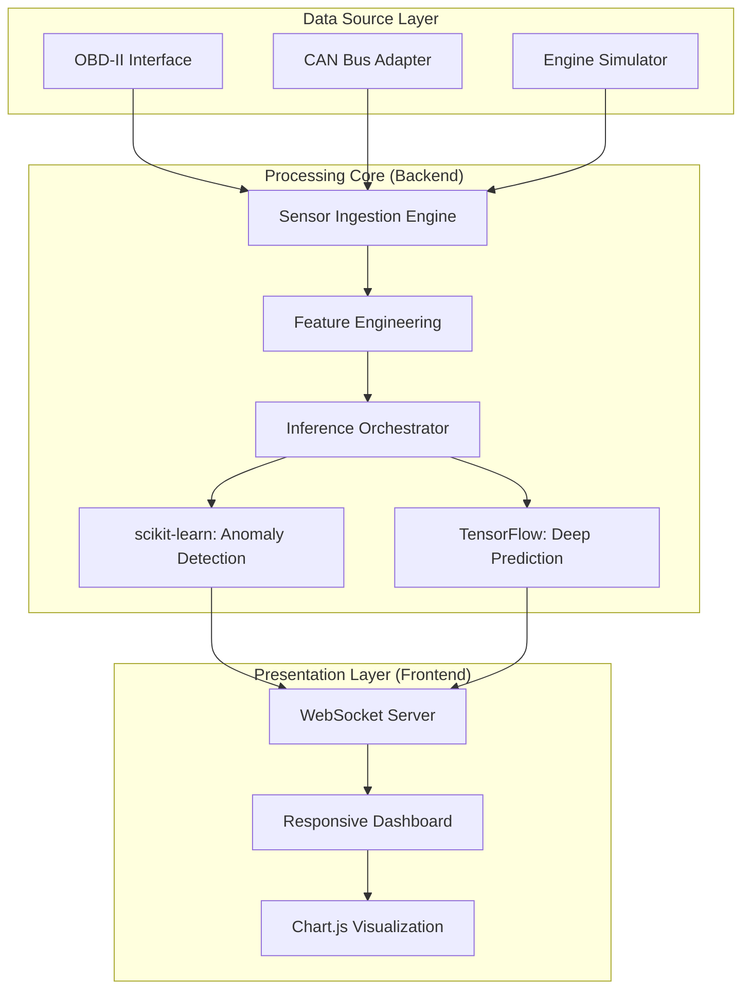
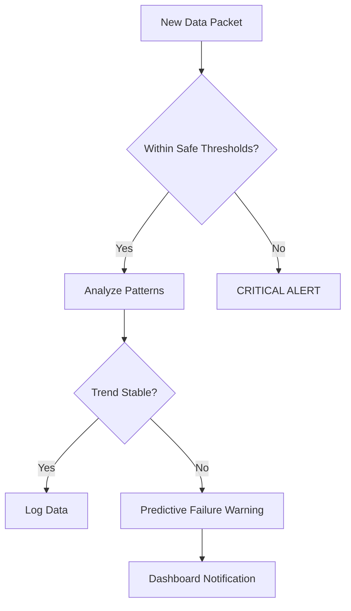

# 📈 2JZ-GTE Predictive Monitoring System

[](LICENSE)
[]()
[]()
[]()
[]()
[]()

An advanced, real-time telemetry and machine learning platform engineered for the Toyota 2JZ-GTE engine. This system transforms raw sensor data into actionable insights, predicting potential failures before they occur.

---

## 🧭 Project Vision

The 2JZ-GTE is a legendary engine, often pushed to extreme limits. This project bridges the gap between conventional tuning and intelligent monitoring.

By leveraging a dual-engine ML approach, the system detects subtle anomalies in sensor data—such as irregular boost gradients or thermal expansion patterns—that traditional threshold-based systems often miss.

### Core Objectives

- **Predictive Maintenance**: Shift from reactive fixes to proactive prevention  
- **High-Fidelity Telemetry**: Sub-50ms latency for real-time decision-making  
- **Safety Buffer**: Early detection of lean conditions and turbo instability  

---

## 🏗 System Architecture

### High-Level Component Map



---

## 🛠 Developer Deep Dive

### Mechanism of Prediction

- **Boost Gradient** → Rate of pressure increase  
- **AFR Delta** → Deviation from target lambda  

### Key Components

- **Feature Engineering**
  - Located in `backend/processing/`
  - Derived metrics:
    - Thermal rate of change  
    - Oil pressure vs RPM correlation  

- **Dual Inference Pipeline**
  - **scikit-learn** → anomaly detection  
  - **TensorFlow** → LSTM/GRU time-series prediction  

---

## 📁 Directory Structure

```text
├── backend/
├── frontend/
├── model/
├── integrations/
├── data/
├── tests/
└── docker-compose.yml
```

---

## 🚀 Installation & Usage

### Quickstart (Docker)

```bash
git clone https://github.com/HimalayPandit/2JZ-GTE-Predictive-Monitoring-System.git
cd 2JZ-GTE-Predictive-Monitoring-System
docker-compose up --build
```

Open: http://localhost:3000

---

## 🚦 Decision Logic & Alerts



---

## ⚖️ License & Disclaimer

Licensed under **GPL-3.0**

This software is for monitoring and educational purposes only. Use at your own risk.

---

## 👤 Maintainer

Himalay Pandit  
https://github.com/HimalayPandit
